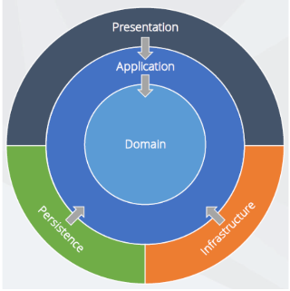

# Railway Routes Manager

[](https://dev.azure.com/dakenzi97/RvaProjekat/_build/latest?definitionId=1&branchName=master)
[](https://dev.azure.com/dakenzi97/d60d784a-e122-4c92-a447-3ccb352a5663/_boards/board/t/4248bfb9-fe72-4b6f-a6e7-193b9bfd7451/Microsoft.RequirementCategory/)

School Project from Multi-tier applications development class in Faculty of Technical Sciences - University of Novi Sad 🏫

## Table of Contents

- [Getting Started](#Getting-Started)
  - [Prerequisites](#Prerequisites)
  - [Setup](#Setup)
- [Usage Guide](#Usage-Guide)
  - [Server](#Server)
  - [Client](#Client)
    - [Routes](#Routes)
    - [Stations](#Stations)
    - [Log](#Log)
    - [Profile](#Profile)
- [Architecture](#Architecture)
  - [Core](#Core-Layer)
  - [Infrastructure](#Infrastructure-Layer)
  - [Persistance](#Persistance-Layer)
  - [Presentation](#Presentation-Layer)
- [Design Patterns](#Design-Patterns)
  - [Repository and Unit of Work](#repository-and-unit-of-work)
  - [Decorator](#decorator)
  - [Command](#command)
  - [Factory Method](#factory-method)
  - [Facade](#facade)
  - [Template Method](#template-method)
  - [Prototype](#prototype)

---

## Getting Started

Use these instructions to get the project up and running.

### Prerequisites

You will need the following tools:

* [Visual Studio 2017-2019](https://www.visualstudio.com/downloads/)
* [.NET Framework 4.7.2](https://dotnet.microsoft.com/download/dotnet-framework/net472)

### Setup

Follow these steps to get your development environment set up:

1. Restore NuGet Packages & Build solution
1. (Optional) Set solution to multiple startup projects ( *Right Click Solution > Properties > Multiple Startup Perojects*) where `Server.WCF` project will be loaded first and then `Client.DesktopUI`
1. Run solution


> Note: For best user experience (without interruptions from debugger) it is advised to run project without debugging (either with `CTRL+F5` or by running it in `Release` Mode).


---

## Usage Guide

This section will focus on how to use this application, as well as give brief explanation on what each display does.

### Server

Console Application which hosts `WCF` services. It displays log information which can be configured in App.config by setting `level` value to one of the following: `(ALL, DEBUG, INFO, WARN, ERROR, FATAL, OFF)`

```xml
<log4net>
 <root>
  <level value="INFO"/>
 </root>
</log4net>
```

User can close *Server* by pressing `ENTER` on keyboard.


### Client

WPF Desktop Application through which User can interract with [Server](#server).

Once the application has been run, user will be greeted with Login screen after which he will have different view options based on his role (*Administrator* or *Regular User*). 


Each user has options to view Routes, Stations, Log information, Profile and to Sign Out:


Administrator has special view dedicated to him which is to see the list of *Users* and to add them:


### Routes

Displays railway routes as list of expandable elements that (once clicked) themselves display list of stations that are included in that route. 


User can Add, Duplicate, Edit and Delete routes upon which modal popup window would be shown.


Additional available commands are Undo, Redo and Refresh.

### Stations

Similar to Routes this view presents list of expandable items, but unlike in previous view, user can modify and delete Railway Platforms directly in the expanded table.


### Log

Displays Log information in table. User can see potential conflicts, information and errors in this view. Just like in [Server](#server) log level can be modified in `App.config` file


### Profile

Each user can edit their first and last name.


---

## Architecture

As mentioned previously this application consists of `Client` - Front End and `Server` - Back End. 

Both Front and Back end are then layered individually into sublayers such as `Core`, `Infrastructure`, `Persistance` which share common purpose.



### Core Layer

Represents combination of *Domain* and *Application* layers. 

*Domain layer* - Contains all entities, enums, exceptions, types and logic specific to the domain.

*Application layer* - contains all application/business logic. It is dependent on the domain layer, but has no dependencies on any other layer or project. This layer defines interfaces that are implemented by outside layers. For example, if the application need to access a notification service, a new interface would be added to application and an implementation would be created within infrastructure.

### Infrastructure Layer

This layer contains classes for accessing external resources such as file systems, web services, smtp, and so on. These classes are based on interfaces defined within the [Core](#core-layer) layer.

### Persistance Layer

Represents implementation of interfaces from the [Core](#core-layer) layer related to Database. 
In this case it represents classes related to Entity Framework like DbContext, Migrations, Fluent API Configurations, Database Initialization (Seed) method, etc.


### Presentation Layer

Holds logic related to GUI, which in this case is WPF Desktop Application. It depends on all of the other layers but none of them depend on Presentation layer. Purpose of clean architecture is to abstract this layer as much as possible so that it can be easily switchable.

---

## Design Patterns

In software engineering, a design pattern is a general repeatable solution to a commonly occurring problem in software design. A design pattern isn't a finished design that can be transformed directly into code. It is a description or template for how to solve a problem that can be used in many different situations.

### Repository and Unit of Work

*Repository* - Mediates between the domain and data mapping layers using a collection-like interface for accessing domain objects.

*Unit of Work* - Maintains a list of objects affected by a business transaction and coordinates the writing out of changes and the resolution of concurrency problems.


### Decorator

Decorator pattern allows a user to add new functionality to an existing object without altering its structure. This type of design pattern comes under structural pattern as this pattern acts as a wrapper to existing class.

This pattern creates a decorator class which wraps the original class and provides additional functionality keeping class methods signature intact.

### Command

Command pattern is a data driven design pattern and falls under behavioral pattern category. A request is wrapped under an object as command and passed to invoker object. Invoker object looks for the appropriate object which can handle this command and passes the command to the corresponding object which executes the command.

### Factory Method

In class-based programming, the factory method pattern is a creational pattern that uses factory methods to deal with the problem of creating objects without having to specify the exact class of the object that will be created. This is done by creating objects by calling a factory method—either specified in an interface and implemented by child classes, or implemented in a base class and optionally overridden by derived classes—rather than by calling a constructor.

### Facade

Facade pattern hides the complexities of the system and provides an interface to the client using which the client can access the system. This type of design pattern comes under structural pattern as this pattern adds an interface to existing system to hide its complexities.

This pattern involves a single class which provides simplified methods required by client and delegates calls to methods of existing system classes.

### Template Method

Template method pattern is a behavioral design pattern that defines the program skeleton of an algorithm in an operation, deferring some steps to subclasses. It lets one redefine certain steps of an algorithm without changing the algorithm's structure.

### Prototype

The prototype pattern is a creational design pattern in software development. It is used when the type of objects to create is determined by a prototypical instance, which is cloned to produce new objects.